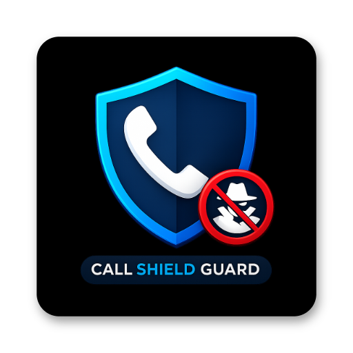

# Call Guard Shield

  

Call Guard Shield is a powerful, privacy-focused Android call screening application designed to protect you from spam, scams, and unwanted callers. Leveraging local database rules and optional Google Gemini AI intelligence, it provides a robust firewall for your phone.

## 🛡️ Key Features

- **AI-Powered Investigation:** Identify unknown callers using real-time web research powered by Google's Gemini AI (requires your own API key).
- **Global Spam Database:** Automatically block thousands of known spam numbers sourced from FCC and community records.
- **Custom Blacklists & Whitelists:** Take full control by manually blocking specific numbers or patterns, and ensuring important contacts always get through.
- **Strict Contact Mode:** Option to only allow calls from people already in your address book.
- **Privacy First:** All call processing happens locally on your device. Call logs and contacts are never uploaded to our servers.
- **Google Cloud Sync:** Securely backup and restore your settings and custom lists to your own Google Drive.
- **Material 3 Design:** A modern, clean interface with full support for system themes.

## 🚀 Getting Started

1. **Install the App:** Build and install the APK on your Android device (Android 10+ recommended).
2. **Grant Permissions:** The app requires standard permissions for Contacts, Phone, and Notifications to function as a call screener.
3. **Set as Default:** For best results, set Call Guard Shield as your default **Spam and Call ID** app in system settings.
4. **Configure AI (Optional):** Add your Gemini API key in the Settings menu to enable deep investigation features.

## 🛠️ Built With

- **Language:** Kotlin
- **UI Framework:** Jetpack Compose (Material 3)
- **Database:** Room Persistence Library
- **Networking:** Retrofit & OkHttp
- **AI Integration:** Google Generative AI SDK (Gemini)
- **Background Tasks:** WorkManager
- **Preferences:** Jetpack DataStore

## 📄 Privacy Policy

We take your privacy seriously. Call Guard Shield does not sell or share your personal data. Read our full [Privacy Policy](privacy.md) for more details.

## ⚖️ License

This project is intended for personal use and evaluation.
